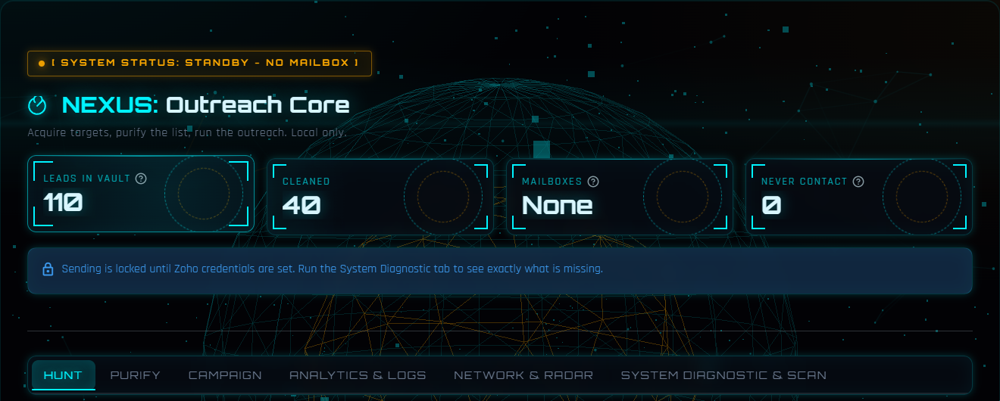
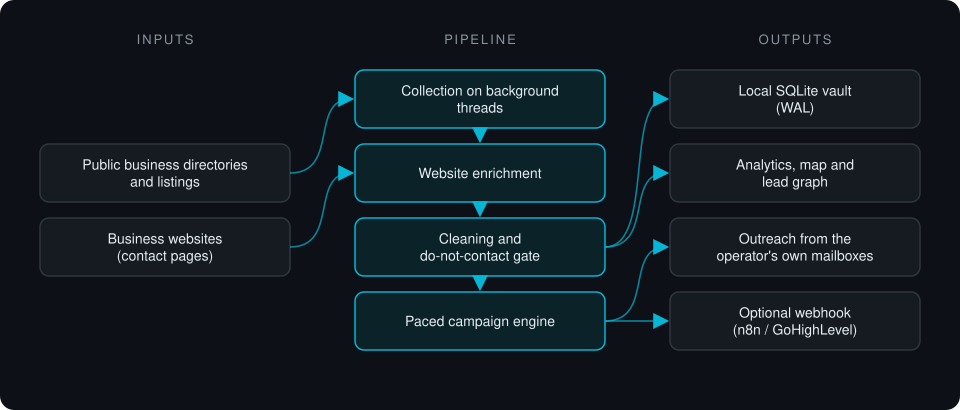

# NEXUS Outreach Core

**Local-first lead pipeline: collects business leads from public directories, enriches each one from its own website, cleans the list to deliverable addresses and runs paced email outreach from the operator's own mailboxes.**

> **This is a proprietary project. Source code is private. This page showcases the system's architecture and results.**

**Case study page:** [https://jryahia.github.io/showcase-nexus-outreach-core/](https://jryahia.github.io/showcase-nexus-outreach-core/)

## Problem it solves

Lead-generation SaaS is expensive and keeps your lead data on someone else's servers. Lists pulled from public directories are full of duplicates, role inboxes and addresses that bounce, and sending them in bulk from one inbox damages the sender's domain. NEXUS runs the whole pipeline on the operator's machine, from finding and enriching leads to sending a paced campaign, with the data in a local SQLite file.

## Architecture

1. Collectors query public business directories and community listings by keyword and location, on background threads so the console never blocks.
2. Each business website and its contact pages are visited to resolve a contact address the listing did not show.
3. A cleaning stage deduplicates, validates syntax, drops role inboxes and scraper false positives, and applies the do-not-contact list.
4. The campaign engine sends from the operator's configured mailboxes with randomized gaps, a hard daily cap and A/B templates. The do-not-contact check runs before a message is built.
5. Everything lands in a local SQLite store (WAL mode) that feeds analytics, a geographic map and a lead graph, with an optional webhook to n8n or GoHighLevel.

## Key features

- Local-first: no account, no telemetry, lead data never leaves the machine
- Multi-source collection with website enrichment for listings that hide contact details
- List hygiene: dedup, syntax checks, role-inbox and false-positive filtering, do-not-contact list
- Paced sending with daily caps; STOP cancels mid-delay instead of after the current wait
- Sending stays locked until mailbox settings are valid; a diagnostic tab lists exactly what is missing
- Offline self-test suite: 485 checks pass on a clean checkout

## Tech stack

      

## What it does in practice

- Replaces a paid lead-gen subscription for small agencies that want to own their lead data.
- Keeps sending volume and pacing under the operator's control, with opt-out handling enforced before any message is built.

## Screenshots

**Command console: lead counts, mailbox status and the send lock**

---

Built by [Yahya Jarray](https://github.com/jryahia). Interested in a similar system? [Get in touch](mailto:yahiajarray43@gmail.com).

This repository contains no source code. It is a case study for a proprietary project. © Yahya Jarray.
